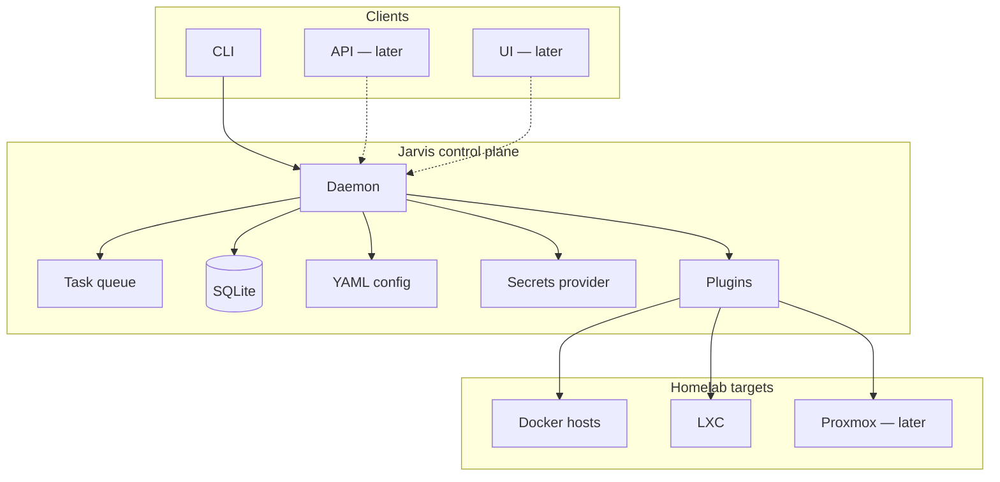
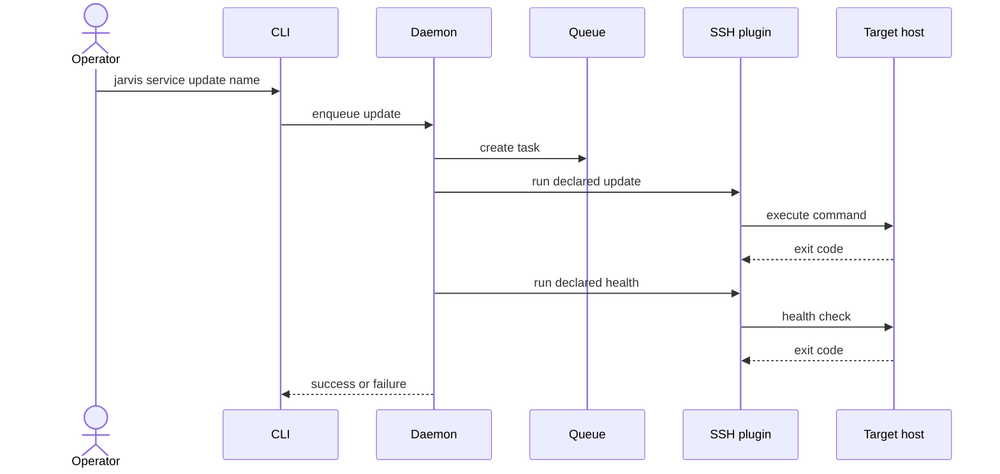

# Jarvis

Self-hosted control plane for administering and automating a homelab.

Go, open source, declarative YAML config, backend-first. The CLI is a client; the engine is a daemon.

## Why this exists

Homelab ops today means logging into hosts over SSH, remembering which compose file or LXC to touch, running updates by hand, and eyeballing whether things still work. That does not scale with the number of services, and it is a poor habit for both reliability and security.

Jarvis is the single place to declare how services are operated, enqueue work safely, and judge success with health checks - not with "the command returned."

Secondary goal: grow skills across backend, architecture, infra, security, CI/CD, observability, and later AI, through a tool that is actually used every week.

## Product vision (A → Z)

Jarvis should become the **ops control plane** for the homelab:

1. **Declare** services, hosts, credentials, and actions in config - not in ad-hoc scripts.
2. **Act** through a daemon that queues, runs, and records every mutation.
3. **Verify** with explicit health checks as the success criterion.
4. **Extend** via plugins so the core never hardcodes Docker, LXC, Proxmox, or Portainer.
5. **Harden** secrets, network access, and auditability so day-to-day admin SSH fades away.
6. **Observe** tasks, failures, and latency with proper telemetry.
7. **Expose** (later) a network API and optional UI for humans and automation.
8. **Scale concurrency** carefully (per-service workers) without losing safety.

V1 is the first slice of that vision: the smallest path that removes weekly SSH pain and proves the architecture.

## Guiding principles

| Principle | Meaning |
| --- | --- |
| Backend first | Daemon + CLI before UI or public API |
| Declarative ops | Actions live in YAML; the core executes and records |
| Plugins over special cases | Targets are drivers, not if/else in the engine |
| Health is success | Exit code of the declared health command decides the outcome |
| Secrets never in cleartext | Always `provider` + `ref`; real backends come after a stub |
| Safe by default | Global queue, no auto-retry, explicit timeouts |
| Used weekly | Scope follows real pain, not portfolio theater |

## Target architecture

High-level control plane: clients talk to the daemon; the daemon owns queue, state, config, and plugins that reach hosts.



### Core ideas

- **Task engine** - every action becomes a task: status, progress, logs, history, timeout.
- **Plugins** - the core does not know target systems; plugins run declared commands or native APIs.
- **Config** - one YAML per service; hosts and credentials live separately.
- **Transport (V1)** - Unix socket between CLI and daemon.
- **Runtime (V1)** - daemon on an LXC named `jarvis`.

### Config shape (illustrative)

Secrets are never plain values in files:

```yaml
credentials:
  provider: stub
  ref: homelab/docker-host
```

Example service:

```yaml
name: harmony
host: docker-host
actions:
  update: "cd /opt/harmony && docker compose pull && docker compose up -d"
  health: "curl -fsS http://127.0.0.1:8080/health"
```

## V1 scope

Replace manual SSH for **update / restart** of services, with **health** as the success criterion.

### Update flow



`jarvis service status <name>` = the same health check, without mutation.

### V1 decisions

| Topic | Choice |
| --- | --- |
| Success | Dual: weekly ops + portfolio; V1 = real pain |
| Targets | Docker + LXC via declarative actions (no hardcoded business logic) |
| Runtime | Daemon on LXC `jarvis` + CLI |
| Transport | Unix socket |
| Task state | SQLite |
| Concurrency | Global queue, one task at a time |
| Retry | None (manual re-run) |
| Secrets | `provider` + `ref` contract + stub |
| Config | One YAML per service; hosts/credentials separate |
| Pilot services | `harmony` (Docker), `cockpit` (LXC) |

### Out of V1

Network API, UI, Proxmox / Portainer / native Docker plugins, OpenTelemetry, multi-user / SSO, daemon HA, worker pool, real secret backends (Vault, OpenBao, etc.).

### Done when

`update` + `status` work on `harmony` and `cockpit`; tasks and logs are trackable via CLI + SQLite.

Formal acceptance criteria: [requirements.md](requirements.md).

## Security (target state)

- Isolated admin network.
- Jarvis as the single day-to-day entry point for service ops.
- No routine direct admin SSH once the control plane is trusted.
- Secrets always resolved through a provider; never committed in cleartext.

## What the project should demonstrate

Clean architecture, plugins, async tasks, abstracted secrets, observability, CI/CD, documentation, and code quality - maintainable software, not a disposable web app.
